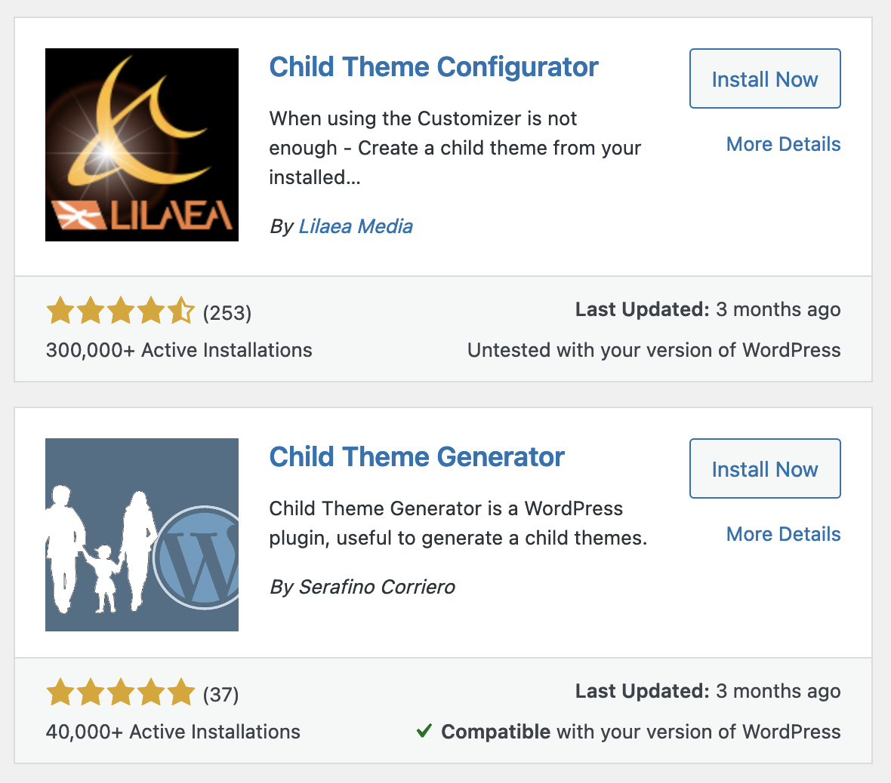
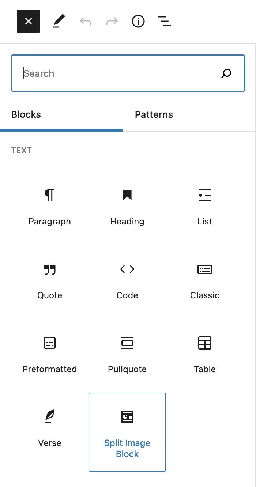
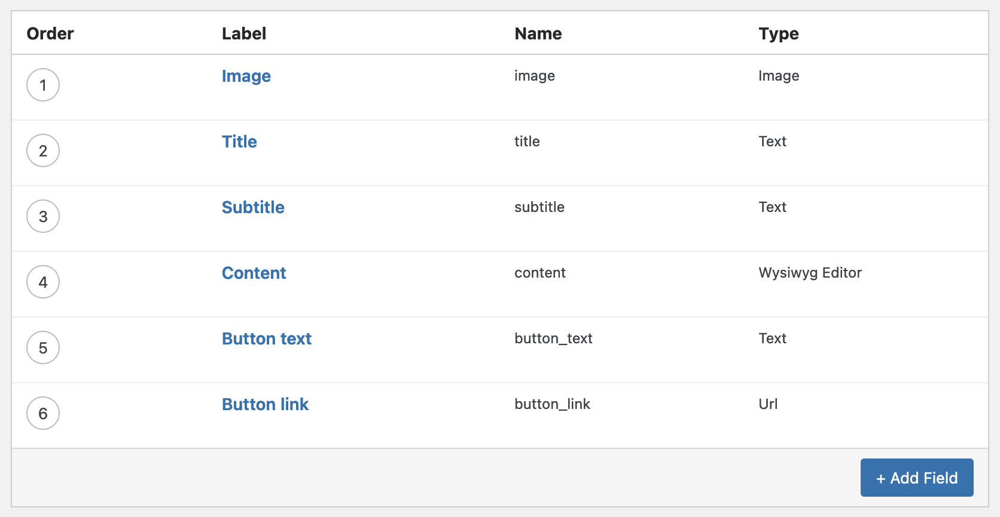
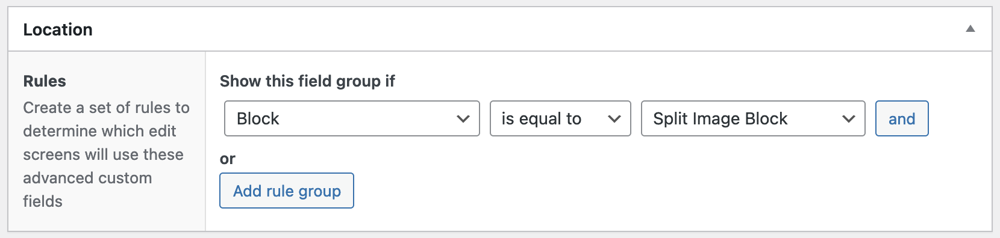
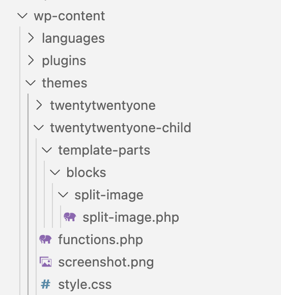
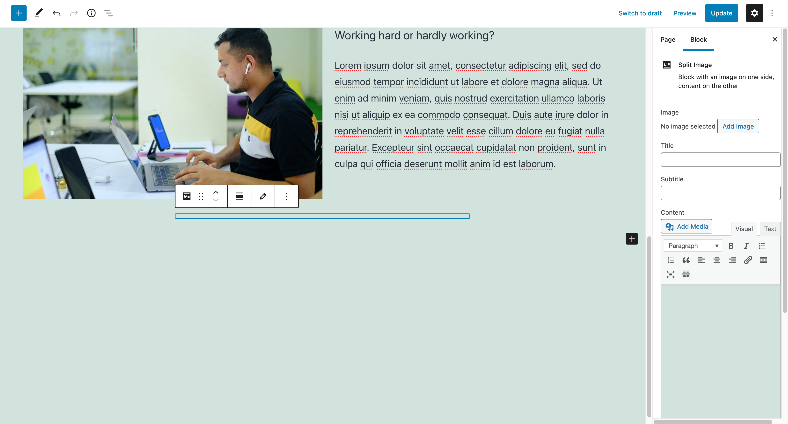
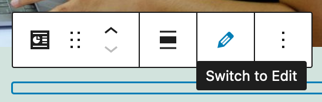
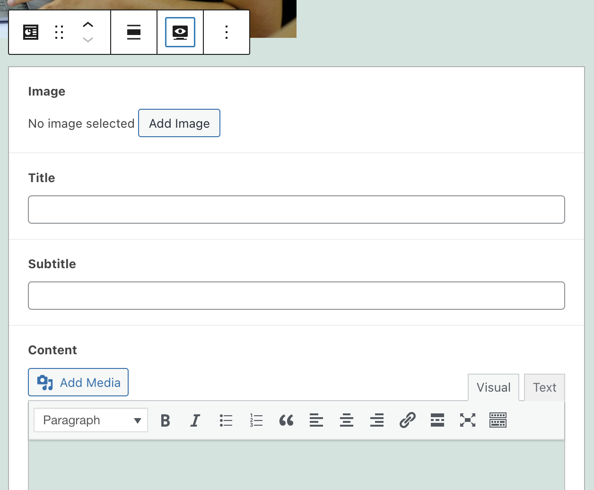

autoscale: true
slidenumbers: true

# [fit] Using Advanced Custom Fields<br>to Create Custom Blocks

Jason Lawton
WordPress Developer
MCS

---

# What we will cover

- Why create a block using ACF?
- What we want to accomplish
- Creating a child theme
- Block Registration
- Creating the block in ACF
- Block template coding
- Using the block in the editor
- Final result

---

# Why create a block using ACF?

- You are comfortable using ACF
- You have good knowledge of PHP, but are not strong in Javascript
- You have an idea for a layout for your site, but can't find the right block, or combination of blocks that fits your needs

^ You are comfortable using ACF and want to add more functionality to the block editor without having to learn React
^ You have good knowledge of PHP, but are not strong in Javascript - you want to add more functionality to the block editor without having to learn React
^ You have an idea for a layout for your site, but can't find the right block, or combination of blocks that fits your needs, so you want to build your own

---

# What do we want to make?

- Split image block
  - Image
  - Title
  - Subtitle
  - Content
  - Call to action

---

# What else do we want to make?

- A block that combines a block and posts
  - Title
  - Content
  - List of posts
    - Number of posts
    - Category

---

# How are we going to make it?

- Create a child theme
- Add php code to register the ACF block
- Set up the fields in ACF
- Code the PHP template
- Use the ACF block in the editor
- View it on the front end of the site

---

# [fit] Creating a child theme

- We're going to use the normal twenty twenty-one theme
- Use a plugin like [Child Theme Configurator](https://wordpress.org/plugins/child-theme-configurator/) or [Child Theme Generator](https://wordpress.org/plugins/child-theme-generator/)



---

# Block Registration

* Now that we have created a child theme, we can edit the `functions.php` file
* Add the following code to the functions.php file

```php
add_action('acf/init', 'my_acf_blocks_init');
function my_acf_blocks_init() {
    // Check if function exists.
    if( function_exists('acf_register_block_type') ) {
        // Register a split image block.
        acf_register_block_type(array(
            'name'            => 'jhl-split-image-block',
            'title'           => __('Split Image'),
            'description'     => __('Block with an image on one side, content on the other'),
            'render_template' => 'template-parts/blocks/split-image/split-image.php',
            'enqueue_style'   => get_stylesheet_directory_uri() . '/template-parts/blocks/split-image/split-image.css',
            'category'        => 'layout',
            'icon'            => 'analytics'
        ));
    }
}
```

Full documentation available at [ACF register block type](https://www.advancedcustomfields.com/resources/acf_register_block_type/)

^ name — This is the name of the block you’ll be creating. It will be used to make the whole thing work and can only contain alphanumeric characters and dashes.
^ title — This is the title of the block as it will appear in the Gutenberg editor.
^ description — A description of what your block does. This shows up in the sidebar of the editor.
^ render_template — This refers to the file used to render the block.
^ category — Means the block category your block will appear under. Choices include common, formatting, layout, widgets, embeds.
^ icon — The icon associated with your block. You can choose from the Dashicons (post the name without the dashicons- in front). Optionally, use a custom SVG file.
keywords — What users can type in to find your block. You can use up to three terms here.

---

# Block Registered

At this point we can go to the block editor and see that the block is registered correctly and shows up in the list of available blocks.

However if we click on it, nothing happens because the block is not hooked up to ACF yet.



---

# Creating the block in ACF

- Think about the creating a block in the same way you think about using ACF in other situations
- Break down the block into a form that the user will fill out
  - Image
  - Title
  - Subtitle
  - Content
  - Call to action
      - Button text
      - Button link

---

# Creating the block in ACF

Create the fields in ACF



---

# Creating the block in ACF

Set the appearance to "Block" and the name of the block we specified earlier "Split Image Block"



---

# Block template coding

```php
acf_register_block_type(array(
    'name'            => 'jhl-split-image-block',
    'title'           => __('Split Image'),
    'description'     => __('Block with an image on one side, content on the other'),
    'render_template' => 'template-parts/blocks/split-image/split-image.php',
    'enqueue_style'   => get_stylesheet_directory_uri() . '/template-parts/blocks/split-image/split-image.css',
    'category'        => 'layout',
    'icon'            => 'analytics'
));
```

---

# Block template coding

[.code-highlight: 5]

```php
acf_register_block_type(array(
    'name'            => 'jhl-split-image-block',
    'title'           => __('Split Image'),
    'description'     => __('Block with an image on one side, content on the other'),
    'render_template' => 'template-parts/blocks/split-image/split-image.php',
    'enqueue_style'   => get_stylesheet_directory_uri() . '/template-parts/blocks/split-image/split-image.css',
    'category'        => 'layout',
    'icon'            => 'analytics'
));
```

---

# Block template coding

Create the folder structure in your child theme

`template-parts/blocks/split-image/`

Create a file called `split-image.php`



---

# Block template coding

```html
<?php
$acf_fields = get_fields();
$align_class = $block['align'] ? 'align' . $block['align'] : '';
?>
<div class="split-image-wrapper <?php echo $align_class; ?>">
  <div class="split-image-text">
    <div class="split-image-title"><?php echo $acf_fields['title']; ?></div>
    <div class="split-image-subtitle"><?php echo $acf_fields['subtitle']; ?></div>
    <div class="split-image-content"><?php echo $acf_fields['content']; ?></div>
    <div class="split-image-button">
      <a href="<?php echo $acf_fields['button-link']; ?>"><?php echo $acf_fields['button-text']; ?></a>
    </div>
  </div>
  <div class="split-image-image" style="background-image:url(<?php echo $acf_fields['image']; ?>);"></div>
</div>
```

^ Show actual code with if statements and better formatting

---

# Using the block in the editor



---

# Using the block in the editor



---

# Using the block in the editor



^ Demo it in the editor

---

# Final result in editor


---

# Final result on site


---

# References

- [https://www.advancedcustomfields.com/resources/blocks/]()
- [https://torquemag.io/2020/01/create-gutenberg-block-with-acf/]()
- [https://whiteleydesigns.com/acf-gutenberg-block-examples/]()

---

# Q&A

---

# Thank you

