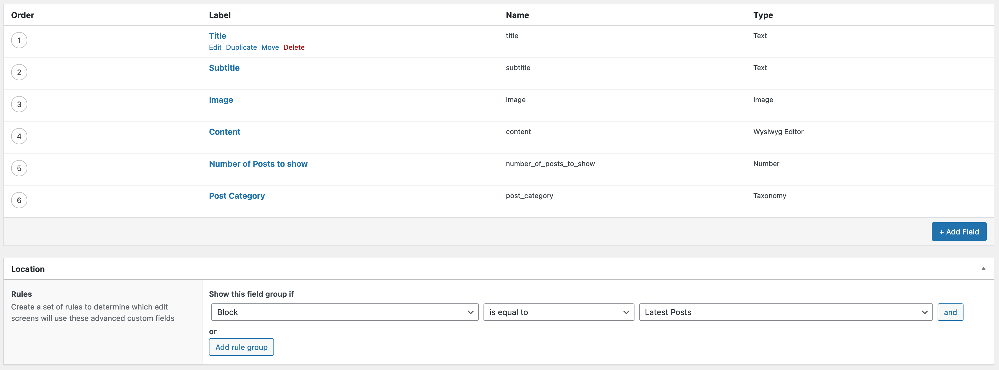
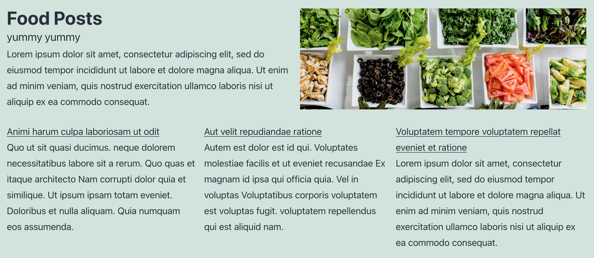
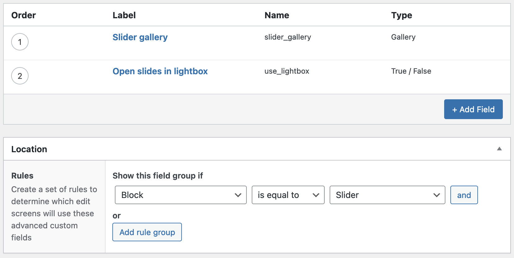
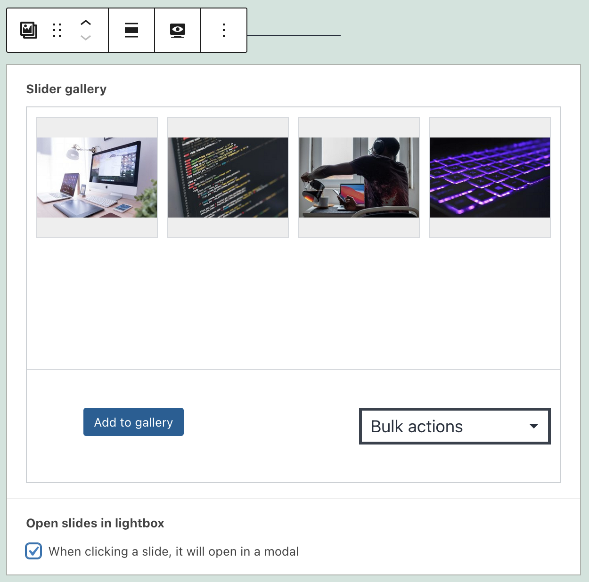
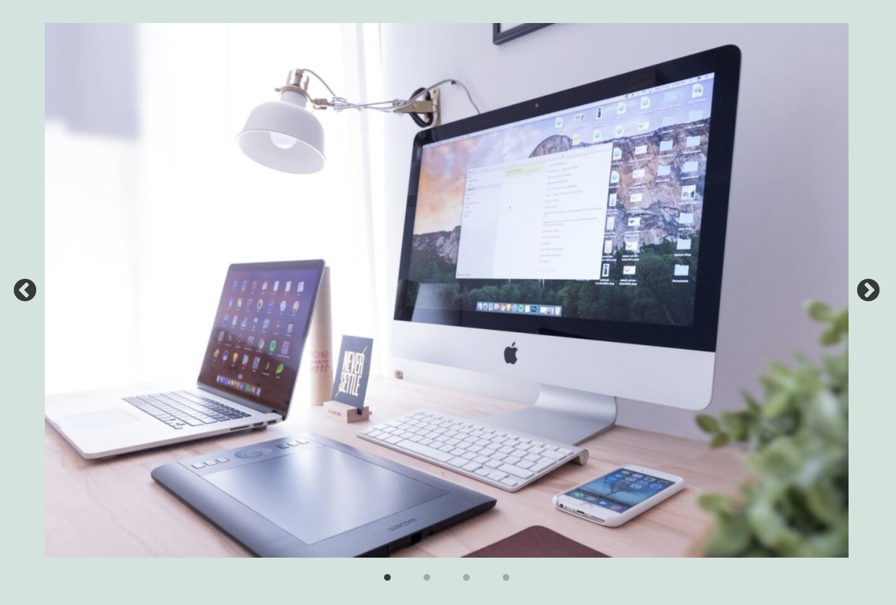

autoscale: false
slidenumbers: true

# [fit] Using Advanced Custom Fields<br>to Create Custom Blocks

Jason Lawton
WordPress Developer
MCS

---

# What we will cover

- Why create a block using ACF?
- What we want to accomplish
- Creating a child theme
- Block registration
- Creating the block in ACF
- Block template coding
- Using the block in the editor
- Final result

---

# Why create a block using ACF?

- You are comfortable using ACF
- You have good knowledge of PHP, but are not strong in Javascript
- You have an idea for a layout for your site, but can't find the right block, or combination of blocks that fits your needs

^ You are comfortable using ACF and want to add more functionality to the block editor without having to learn React
^ You have good knowledge of PHP, but are not strong in Javascript - you want to add more functionality to the block editor without having to learn React
^ You have an idea for a layout for your site, but can't find the right block, or combination of blocks that fits your needs, so you want to build your own

---

# What do we want to make?

Split image block

  - Image
  - Title
  - Subtitle
  - Content
  - Call to action

---

# What else do we want to make?

Latest posts block

  - Title
  - Content
  - List of posts
      - Number of posts
      - Category

---

# Anything else?

Slider block

  - Gallery of images
  - Open image in a modal window

This is a more advanced block that loads javascript libraries for showing the gallery of images in a slider.

---

# How are we going to make them?

- Create a child theme
- Add php code to register the ACF block
- Set up the fields in ACF
- Code the PHP template
- Use the ACF block in the editor
- View it on the front end of the site

---

# [fit]Creating a child theme

We're going to use the normal twenty twenty-one theme

Use a plugin like [Child Theme Configurator](https://wordpress.org/plugins/child-theme-configurator/) or [Child Theme Generator](https://wordpress.org/plugins/child-theme-generator/)


---

[.autoscale: true]

# Block registration

Now that we have created a child theme, we can edit the `functions.php` file

Add the following code to the functions.php file

```php
add_action('acf/init', 'my_acf_blocks_init');
function my_acf_blocks_init() {
    // Check if function exists.
    if( function_exists('acf_register_block_type') ) {
        // Register a split image block.
        acf_register_block_type(array(
            'name'            => 'jhl-split-image-block',
            'title'           => __('Split Image'),
            'description'     => __('Block with an image on one side, content on the other'),
            'render_template' => 'template-parts/blocks/split-image/split-image.php',
            'enqueue_style'   => get_stylesheet_directory_uri() . '/template-parts/blocks/split-image/split-image.css',
            'category'        => 'layout',
            'icon'            => 'analytics'
        ));
    }
}
```

Full documentation is available at [ACF register block type](https://www.advancedcustomfields.com/resources/acf_register_block_type/)

^ name — This is the name of the block you’ll be creating. It will be used to make the whole thing work and can only contain alphanumeric characters and dashes.
^ title — This is the title of the block as it will appear in the Gutenberg editor.
^ description — A description of what your block does. This shows up in the sidebar of the editor.
^ render_template — This refers to the file used to render the block.
^ category — Means the block category your block will appear under. Choices include common, formatting, layout, widgets, embeds.
^ icon — The icon associated with your block. You can choose from the Dashicons (post the name without the dashicons- in front). Optionally, use a custom SVG file.
keywords — What users can type in to find your block. You can use up to three terms here.

---

# [fit]Block registration

At this point we can go to the block editor and see that the block is registered correctly and shows up in the list of available blocks.

However if we click on it, nothing happens because the block is not hooked up to ACF yet.


---
[.autoscale: true]

# Creating the block in ACF

Think about the creating a block in the same way you think about using ACF in other situations

Break down the block into a form that the user will fill out

[.column]
- Image
- Title
- Subtitle

[.column]
- Content
- Button text
- Button link

---

# Creating the block in ACF


---

# Creating the block in ACF

Set the appearance to "Block" and the name of the block we specified earlier "Split Image Block"


---

# Block registration

```php
acf_register_block_type(array(
    'name'            => 'jhl-split-image-block',
    'title'           => __('Split Image'),
    'description'     => __('Block with an image on one side, content on the other'),
    'render_template' => 'template-parts/blocks/split-image/split-image.php',
    'enqueue_style'   => get_stylesheet_directory_uri() . '/template-parts/blocks/split-image/split-image.css',
    'category'        => 'layout',
    'icon'            => 'analytics'
));
```

---

# Block registration

[.code-highlight: 5]

```php
acf_register_block_type(array(
    'name'            => 'jhl-split-image-block',
    'title'           => __('Split Image'),
    'description'     => __('Block with an image on one side, content on the other'),
    'render_template' => 'template-parts/blocks/split-image/split-image.php',
    'enqueue_style'   => get_stylesheet_directory_uri() . '/template-parts/blocks/split-image/split-image.css',
    'category'        => 'layout',
    'icon'            => 'analytics'
));
```

^ Render template points to the php file that is used to render the data from the block

---

# Block registration

[.code-highlight: 6]

```php
acf_register_block_type(array(
    'name'            => 'jhl-split-image-block',
    'title'           => __('Split Image'),
    'description'     => __('Block with an image on one side, content on the other'),
    'render_template' => 'template-parts/blocks/split-image/split-image.php',
    'enqueue_style'   => get_stylesheet_directory_uri() . '/template-parts/blocks/split-image/split-image.css',
    'category'        => 'layout',
    'icon'            => 'analytics'
));
```

^ When using a child theme, you have to use `get_stylesheet_directory_uri()` instead of `get_template_diretory_uri()`

---

# Block template coding

Create the folder structure in your child theme

`template-parts/blocks/split-image/`

Create a file called `split-image.php`


---

# Block template coding

```html
<?php
$acf_fields = get_fields();
$align_class = $block['align'] ? 'align' . $block['align'] : '';
?>
<div class="split-image-wrapper <?php echo $align_class; ?>">
  <div class="split-image-text">
    <div class="split-image-title"><?php echo $acf_fields['title']; ?></div>
    <div class="split-image-subtitle"><?php echo $acf_fields['subtitle']; ?></div>
    <div class="split-image-content"><?php echo $acf_fields['content']; ?></div>
    <div class="split-image-button">
      <a href="<?php echo $acf_fields['button-link']; ?>"><?php echo $acf_fields['button-text']; ?></a>
    </div>
  </div>
  <div class="split-image-image" style="background-image:url(<?php echo $acf_fields['image']; ?>);"></div>
</div>
```

^ Show actual code with if statements and better formatting

---

# Split image block in the editor


---

# Split image block in the editor


---

# Split image block in the editor


^ Demo it in the editor

---

# Split image block final result in editor


---

# Split image block final result on site


---

# Latest posts block

This block will support the following fields

- Title
- Subtitle
- Image
- Content
- List of posts from the posts content type
  - Allow the user to specify how many posts
  - Allow the user to specify a category

---

# Block registration

```php
acf_register_block_type(array(
    'name'            => 'jhl-latest-posts-block',
    'title'           => __('Latest Posts'),
    'description'     => __('Block with an title, content, and latest posts'),
    'render_template' => 'template-parts/blocks/latest-posts/latest-posts.php',
    'enqueue_style'   => get_stylesheet_directory_uri() . '/template-parts/blocks/latest-posts/latest-posts.css',
    'category'        => 'layout',
    'icon'            => 'analytics'
));
```

^ basically the same as the split image block code

---

# Creating the block in ACF



---

# Block template coding

```php
$latest_posts_args = [
    'post_type' => 'post',
];
if ( $acf_fields['number_of_posts_to_show'] ) {
    $latest_posts_args['posts_per_page'] = $acf_fields['number_of_posts_to_show'];
}
if ( $acf_fields['post_category'] ) {
    $latest_posts_args['category__in'] = $acf_fields['post_category'];
}
$latest_posts = new WP_Query( $latest_posts_args );
```

^ Additional code is needed to pull in the posts

---

# Block template coding

```html
<?php if ( $latest_posts->have_posts() ) { ?>
    <div class="latest-posts-list <?php echo $align_class; ?>">
        <?php while ( $latest_posts->have_posts() ) {
            $latest_posts->the_post();
            ?>
            <div class="latest-post">
                <div class="latest-post-title">
                    <a href="<?php the_permalink(); ?>"><?php the_title(); ?></a>
                </div>
                <div class="latest-post-content"><?php the_excerpt(); ?></div>
            </div>
        <?php } ?>
    </div>
<?php } ?>
```

---

# Latest posts block in the editor


---

# Latest posts block on site



---

# Slider block

A more advanced example using some javascript to load a gallery of photos into a slider.

--- 

# Block registration

```php
acf_register_block_type(array(
    'name'            => 'slider',
    'title'           => __('Slider'),
    'description'     => __('ACF Slider w/large image support.'),
    'render_template' => 'template-parts/blocks/slider/slider.php',
    'category'        => 'embed',
    'icon'            => 'format-gallery',
    'keywords'        => array( 'slider', 'gallery', 'carousel' ),
    'align_content'   => 'center',
    'enqueue_assets'  => function(){
        // wp_enqueue_style( 'slider-slick',                get_template_directory_uri() . '/template-parts/blocks/slider/slick.min.css' );
        wp_enqueue_style( 'slider-slick',                get_template_directory_uri() . '/template-parts/blocks/slider/slick.css' );
        wp_enqueue_style( 'slider-slick-theme',          get_template_directory_uri() . '/template-parts/blocks/slider/slick-theme.min.css' );
        wp_enqueue_script( 'slider-slick',               get_template_directory_uri() . '/template-parts/blocks/slider/slick.min.js', array('jquery'), '', true );
        wp_enqueue_style( 'slider-slick-lightbox-theme', get_template_directory_uri() . '/template-parts/blocks/slider/slick-lightbox.min.css' );
        wp_enqueue_script( 'slider-slick-lightbox',      get_template_directory_uri() . '/template-parts/blocks/slider/slick-lightbox.min.js', array('jquery','slider-slick'), '', true );
    },
));
```

--- 

[.code-highlight: 8]

# Block registration

You can add keywords to help with searching for blocks

```php
acf_register_block_type(array(
    'name'            => 'slider',
    'title'           => __('Slider'),
    'description'     => __('ACF Slider w/large image support.'),
    'render_template' => 'template-parts/blocks/slider/slider.php',
    'category'        => 'embed',
    'icon'            => 'format-gallery',
    'keywords'        => array( 'slider', 'gallery', 'carousel' ),
    'align_content'   => 'center',
    'enqueue_assets'  => function(){
        // wp_enqueue_style( 'slider-slick',                get_template_directory_uri() . '/template-parts/blocks/slider/slick.min.css' );
        wp_enqueue_style( 'slider-slick',                get_template_directory_uri() . '/template-parts/blocks/slider/slick.css' );
        wp_enqueue_style( 'slider-slick-theme',          get_template_directory_uri() . '/template-parts/blocks/slider/slick-theme.min.css' );
        wp_enqueue_script( 'slider-slick',               get_template_directory_uri() . '/template-parts/blocks/slider/slick.min.js', array('jquery'), '', true );
        wp_enqueue_style( 'slider-slick-lightbox-theme', get_template_directory_uri() . '/template-parts/blocks/slider/slick-lightbox.min.css' );
        wp_enqueue_script( 'slider-slick-lightbox',      get_template_directory_uri() . '/template-parts/blocks/slider/slick-lightbox.min.js', array('jquery','slider-slick'), '', true );
    },
));
```

--- 

[.code-highlight: 10-16]

# Block registration

Use the `enqueue_assets` parameter when you need to add multiple styles or scripts for your block.

```php
acf_register_block_type(array(
    'name'            => 'slider',
    'title'           => __('Slider'),
    'description'     => __('ACF Slider w/large image support.'),
    'render_template' => 'template-parts/blocks/slider/slider.php',
    'category'        => 'embed',
    'icon'            => 'format-gallery',
    'keywords'        => array( 'slider', 'gallery', 'carousel' ),
    'align_content'   => 'center',
    'enqueue_assets'  => function(){
        wp_enqueue_style( 'slider-slick',                get_template_directory_uri() . '/template-parts/blocks/slider/slick.css' );
        wp_enqueue_style( 'slider-slick-theme',          get_template_directory_uri() . '/template-parts/blocks/slider/slick-theme.min.css' );
        wp_enqueue_script( 'slider-slick',               get_template_directory_uri() . '/template-parts/blocks/slider/slick.min.js', array('jquery'), '', true );
        wp_enqueue_style( 'slider-slick-lightbox-theme', get_template_directory_uri() . '/template-parts/blocks/slider/slick-lightbox.min.css' );
        wp_enqueue_script( 'slider-slick-lightbox',      get_template_directory_uri() . '/template-parts/blocks/slider/slick-lightbox.min.js', array('jquery','slider-slick'), '', true );
    },
));
```

---

# Creating the block in ACF



---

# Slider in the block editor



---

# Slider in on the front end



---

# References

- [https://www.advancedcustomfields.com/resources/blocks/]()
- [https://torquemag.io/2020/01/create-gutenberg-block-with-acf/]()
- [https://whiteleydesigns.com/acf-gutenberg-block-examples/]()

---

# Q&A

---

# Thank you

