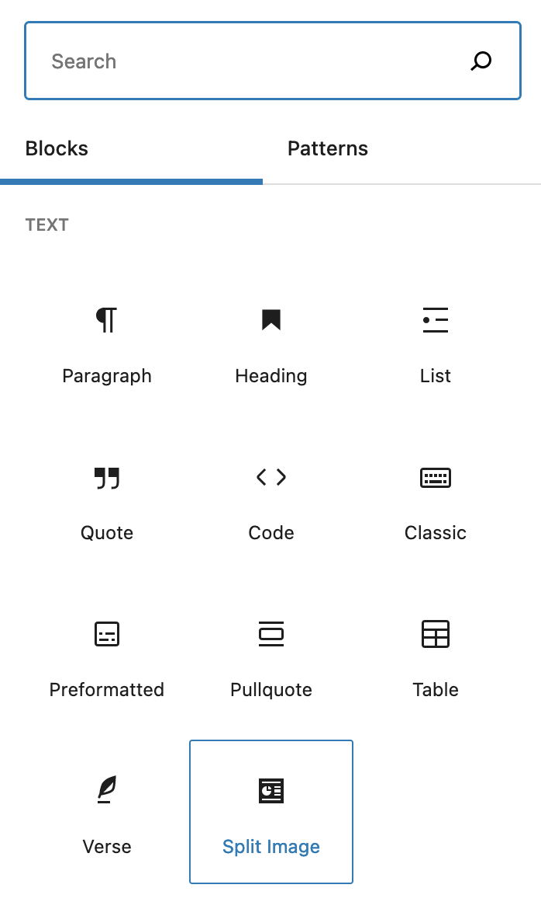

autoscale: true
slidenumbers: true

# [fit] Using Advanced Custom Fields<br>to Create Custom Blocks

Jason Lawton
WordPress Developer
MCS

---

# What we will cover

- Why create a block using ACF?
- What we want to accomplish
- Creating a child theme
- Block Registration
- Creating the block in ACF
- Block template coding
- Using the block in the editor
- Final result

---

# Why create a block using ACF?

- You are comfortable using ACF
- You have good knowledge of PHP, but are not strong in Javascript
- You have an idea for a layout for your site, but can't find the right block, or combination of blocks that fits your needs

^ You are comfortable using ACF and want to add more functionality to the block editor without having to learn React
^ You have good knowledge of PHP, but are not strong in Javascript - you want to add more functionality to the block editor without having to learn React
^ You have an idea for a layout for your site, but can't find the right block, or combination of blocks that fits your needs, so you want to build your own

---

# What do we want to make?

- Split image block
  - Image
  - Title
  - Subtitle
  - Content
  - Call to action

---

# What else do we want to make?

- A block that combines a block and posts
  - Title
  - Content
  - List of posts
    - Number of posts
    - Category

---

# How are we going to make it?

- Create a child theme
- Add php code to register the ACF block
- Set up the fields in ACF
- Code the PHP template
- Use the ACF block in the editor
- View it on the front end of the site

---

# [fit] Creating a child theme

- We're going to use the normal twenty twenty-one theme
- Use a plugin like [Child Theme Configurator](https://wordpress.org/plugins/child-theme-configurator/) or [Child Theme Generator](https://wordpress.org/plugins/child-theme-generator/)


---

# Block Registration

* Now that we have created a child theme, we can edit the `functions.php` file
* Add the following code to the functions.php file

```php
add_action('acf/init', 'my_acf_blocks_init');
function my_acf_blocks_init() {
    // Check if function exists.
    if( function_exists('acf_register_block_type') ) {
        // Register a split image block.
        acf_register_block_type(array(
            'name'            => 'jhl-split-image-block',
            'title'           => __('Split Image Block'),
            'description'     => __('Block with an image on one side, content on the other'),
            'render_template' => 'template-parts/blocks/split-image/split-image.php',
            'category'        => 'layout',
            'icon'            => 'analytics'
        ));
    }
}
```

Full documentation available at [ACF register block type](https://www.advancedcustomfields.com/resources/acf_register_block_type/)

^ name — This is the name of the block you’ll be creating. It will be used to make the whole thing work and can only contain alphanumeric characters and dashes.
^ title — This is the title of the block as it will appear in the Gutenberg editor.
^ description — A description of what your block does. This shows up in the sidebar of the editor.
^ render_template — This refers to the file used to render the block.
^ category — Means the block category your block will appear under. Choices include common, formatting, layout, widgets, embeds.
^ icon — The icon associated with your block. You can choose from the Dashicons (post the name without the dashicons- in front). Optionally, use a custom SVG file.
keywords — What users can type in to find your block. You can use up to three terms here.

---

# Block Registered

At this point we can go see that the block is registered and starting to show up in the block editor.



---

# Creating the block in ACF

- Think about the creating a block in the same way you think about using ACF in other situations
- Break down the block into a form that the user will fill out
  - Image
  - Title
  - Subtitle
  - Content
  - Call to action
      - Button text
      - Button link

---

# Creating the block in ACF

---

# Block template coding

---

# Using the block in the editor

---

# Final result

---

# References

- https://www.advancedcustomfields.com/resources/blocks/
- https://torquemag.io/2020/01/create-gutenberg-block-with-acf/
- https://whiteleydesigns.com/acf-gutenberg-block-examples/

---

# Q&A

---

# Thank you

