autoscale: false
slidenumbers: true

# [fit] Using Advanced Custom Fields<br>to Create Custom Blocks

Jason Lawton
jason@jasonlawton.com
WordPress Developer
Merck - MCS

---

# Who am I?

- Jason Lawton
- WordPress/full stack developer
- Programming for 20 years
- Using WordPress for about 10 years
- Custom themes
- Custom plugins

---

# What we will cover

- Why create a block using ACF
- What we want to accomplish
- Creating a child theme
- Block registration
- Creating the block in ACF
- Block template coding
- Using the block in the editor
- Demo of the final result

---

# What are blocks?

- Blocks are the way in which WordPress organizes content inside your blog posts and/or pages
- Everything is (or will be) a block
- Examples of blocks
  - Paragraph
  - Heading
  - List
  - Image
  - ...and so on

---

# Why create a block using ACF?

- You are comfortable using ACF
- You have good knowledge of PHP, but are not strong in Javascript
- You have an idea for a layout for your site, but can't find the right block, or combination of blocks that fits your needs

^ You are comfortable using ACF and want to add more functionality to the block editor without having to learn React.

^ You have good knowledge of PHP, but are not strong in Javascript - you want to add more functionality to the block editor without having to learn React.

^ You have an idea for a layout for your site, but can't find the right block, or combination of blocks that fits your needs, so you want to build your own.

---

# What do we want to make?

Split image block

  - Title
  - Image
  - Subtitle
  - Content
  - Call to action

^ Block that has an image on one side, and content - title, subtitle, content, and button on the other side.

---

# Split image block


^ Block that has an image on one side, and content - title, subtitle, content, and button on the other side.

---

# What else do we want to make?

Latest posts block

  - Title
  - Content
  - List of posts
      - Number of posts
      - Category

^ This will be similar to the split image block, but will have options to pull in the latest posts from a category.

---

# Latest posts block

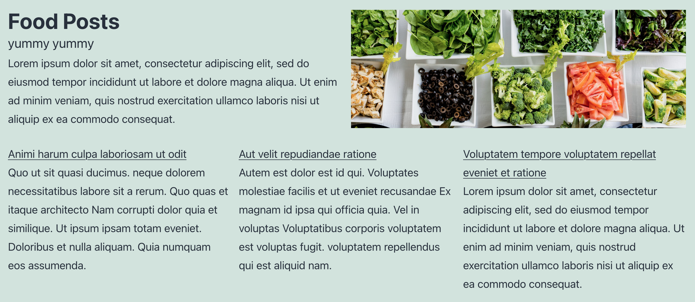

^ This will be similar to the split image block, but will have options to pull in the latest posts from a category.

---

# Anything else?

Slider block

  - Gallery of images
  - Open image in a modal window

This is a more advanced block that loads javascript libraries for showing the gallery of images in a slider.

^ This is a block that will allow the user to upload a set of images and display them in a slider.

---

# Slider block

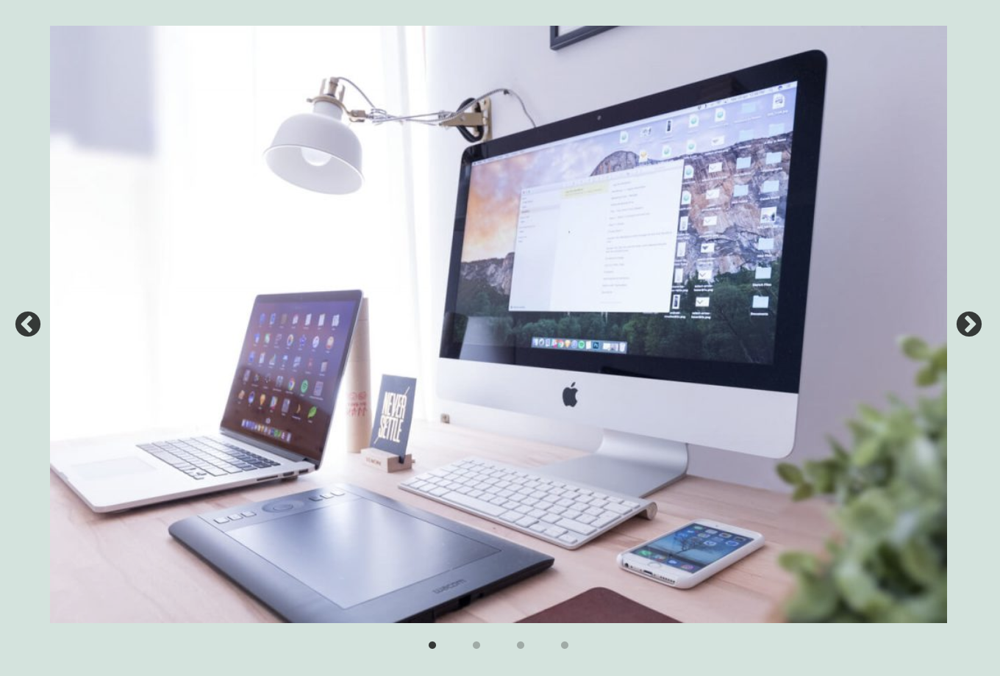

---

# How are we going to make them?

- Create a child theme
- Add PHP code to register the ACF block
- Set up the fields in ACF
- Code the PHP template
- Use the ACF block in the editor
- View it on the front end of the site

^ We are creating a child theme because we have to add code to the functions.php file, and if the main theme gets an update, we don't want to lose the modifications we've done.

^ The other option is to make a custom plugin to load these blocks, it depends if the blocks you're creating are closely tied to the theme you are using.

---

# [fit]Creating a child theme

We're going to use the normal twenty twenty-one theme

To create a child theme, use a plugin like [Child Theme Configurator](https://wordpress.org/plugins/child-theme-configurator/) or [Child Theme Generator](https://wordpress.org/plugins/child-theme-generator/)

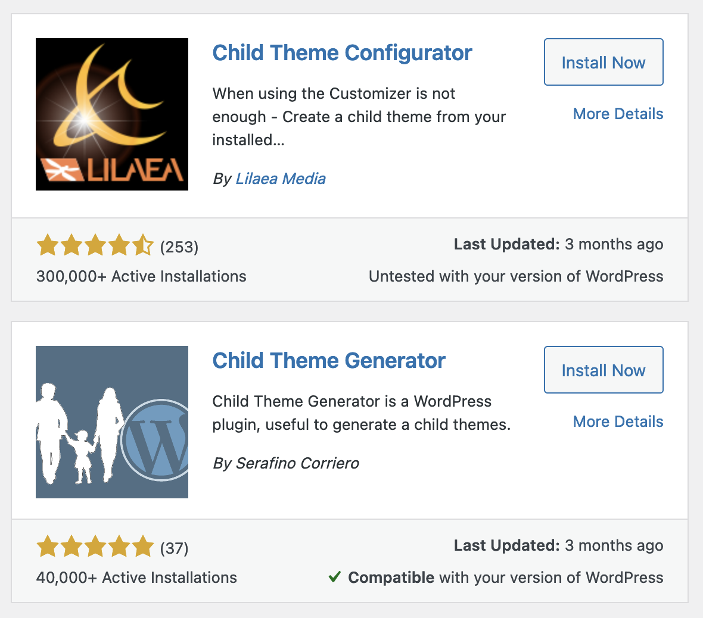

---

[.autoscale: true]

# Block registration

Now that we have created a child theme, we can edit the `functions.php` file

Add the following code to the functions.php file

```php
add_action('acf/init', 'my_acf_blocks_init');
function my_acf_blocks_init() {
    // Check if function exists.
    if( function_exists('acf_register_block_type') ) {
        // Register a split image block.
        acf_register_block_type(array(
            'name'            => 'jhl-split-image-block',
            'title'           => __('Split Image'),
            'description'     => __('Block with an image on one side, content on the other'),
            'render_template' => 'template-parts/blocks/split-image/split-image.php',
            'enqueue_style'   => get_stylesheet_directory_uri() . '/template-parts/blocks/split-image/split-image.css',
            'category'        => 'layout',
            'icon'            => 'analytics'
        ));
    }
}
```

Full documentation is available at [ACF register block type](https://www.advancedcustomfields.com/resources/acf_register_block_type/)

^ name — This is the name of the block you’ll be creating. It will be used to make the whole thing work and can only contain alphanumeric characters and dashes.

^ title — This is the title of the block as it will appear in the Gutenberg editor.

^ description — A description of what your block does. This shows up in the sidebar of the editor.

^ render_template — This refers to the file used to render the block.

^ category — Means the block category your block will appear under. Choices include common, formatting, layout, widgets, embeds.

^ icon — The icon associated with your block. You can choose from the Dashicons (post the name without the dashicons- in front). Optionally, use a custom SVG file.

^ keywords — What users can type in to find your block. You can use up to three terms here.

---

# [fit]Block registration

At this point we can go to the block editor and see that the block is registered correctly and shows up in the list of available blocks.

However if we click on it, nothing happens because the block is not hooked up to ACF yet.


---

[.autoscale: true]

# Creating the block in ACF

Creating a block using ACF is the same as using ACF in general.

Break down the block into a form that the user will fill out.

The difference is that the user can place the block wherever they want, and reuse it multiple times on the page.

^ To me, this is the biggest change and advantage in using blocks. Previously the ACF fields would be at the bottom of the page, and you'd only be able to control where they went by modifying the page template. Using blocks though, you can give the user more control over where and how they use the block.

---

# Creating the block in ACF

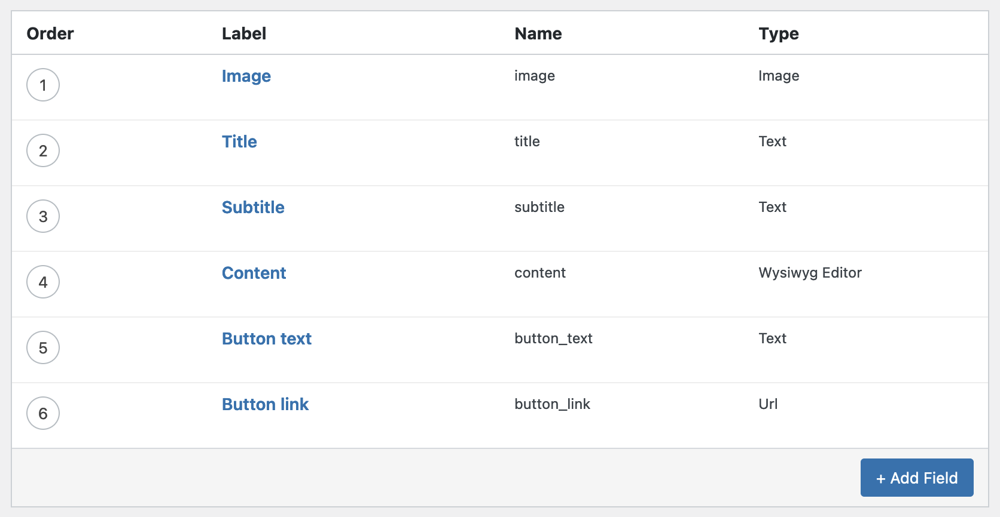

---

# Creating the block in ACF

Set the appearance to "Block" and the name of the block we specified earlier "Split Image Block".

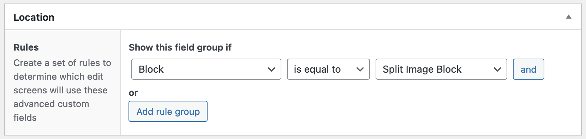

^ Again, this is the big difference between using ACF the old way and the new way. We would normally say something like "post type" "is equal to" "post" to get the fields to show up on the post type page. By setting the block to be equal to the block we registered, we are telling ACF to show these fields when we use the block.

---

# Block registration

```php
acf_register_block_type(array(
    'name'            => 'jhl-split-image-block',
    'title'           => __('Split Image'),
    'description'     => __('Block with an image on one side, content on the other'),
    'render_template' => 'template-parts/blocks/split-image/split-image.php',
    'enqueue_style'   => get_stylesheet_directory_uri() . '/template-parts/blocks/split-image/split-image.css',
    'category'        => 'layout',
    'icon'            => 'analytics'
));
```

^ Lets revisit the `acf_register_block_type` method

---

# Block registration

[.code-highlight: 5]

```php
acf_register_block_type(array(
    'name'            => 'jhl-split-image-block',
    'title'           => __('Split Image'),
    'description'     => __('Block with an image on one side, content on the other'),
    'render_template' => 'template-parts/blocks/split-image/split-image.php',
    'enqueue_style'   => get_stylesheet_directory_uri() . '/template-parts/blocks/split-image/split-image.css',
    'category'        => 'layout',
    'icon'            => 'analytics',
    'mode'            => 'edit',
));
```

^ Render template points to the php file that is used to render the data from the block.

---

# Block registration

[.code-highlight: 6]

```php
acf_register_block_type(array(
    'name'            => 'jhl-split-image-block',
    'title'           => __('Split Image'),
    'description'     => __('Block with an image on one side, content on the other'),
    'render_template' => 'template-parts/blocks/split-image/split-image.php',
    'enqueue_style'   => get_stylesheet_directory_uri() . '/template-parts/blocks/split-image/split-image.css',
    'category'        => 'layout',
    'icon'            => 'analytics',
    'mode'            => 'edit',
));
```

^ When using a child theme, you have to use `get_stylesheet_directory_uri()` instead of `get_template_diretory_uri()`.

---

# Block template coding

Create the folder structure in your child theme

`template-parts/blocks/split-image/`

Create a file called `split-image.php`

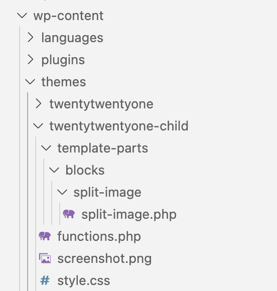

^ Here you can see the folder structure of the wp-content folder. In the themes folder there is the parent theme, twentytwentyone, and the child theme we made earlier, called twentytwentyone-child. Create the folder structure here. Also the whole 'template-parts...' structure is a bit long winded, but it was what was used in the documentation, so it is a 'best-practice'.

---

# Block template coding

```html
<?php
$acf_fields = get_fields();
$align_class = $block['align'] ? 'align' . $block['align'] : '';
?>
<div class="split-image-wrapper <?php echo $align_class; ?>">
  <div class="split-image-text">
    <div class="split-image-title"><?php echo $acf_fields['title']; ?></div>
    <div class="split-image-subtitle"><?php echo $acf_fields['subtitle']; ?></div>
    <div class="split-image-content"><?php echo $acf_fields['content']; ?></div>
    <div class="split-image-button">
      <a href="<?php echo $acf_fields['button-link']; ?>"><?php echo $acf_fields['button-text']; ?></a>
    </div>
  </div>
  <div class="split-image-image" style="background-image:url(<?php echo $acf_fields['image']; ?>);"></div>
</div>
```

^ Show actual code with if statements and better formatting.

^ The `get_fields` gets all of the acf fields and returns them as an array. I find that easier than making separate `get_field` method calls.

^ The `align_class` line gets the width that was specified from the block editor, like wide, full-width, etc.

---

# Split image block in the editor

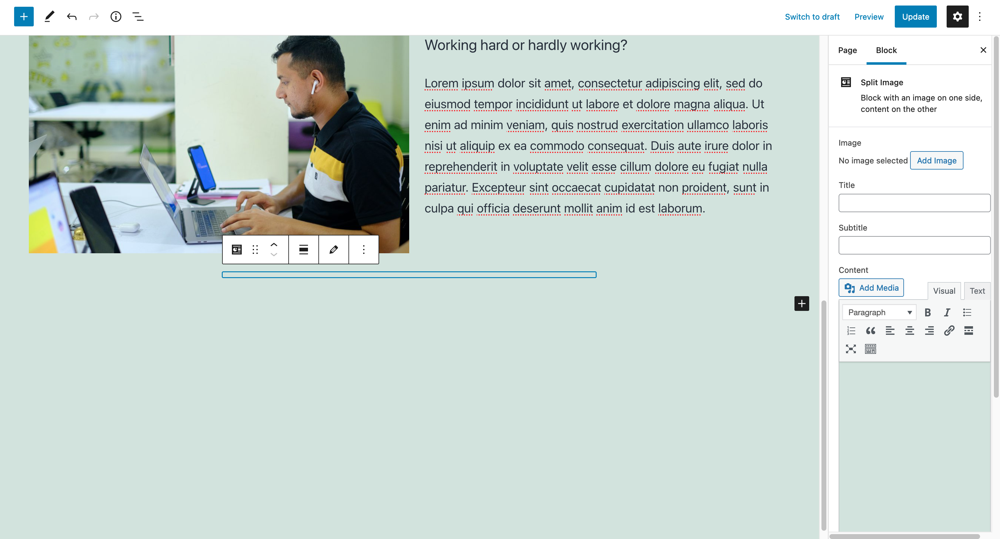

^ When the block is first shown, since there is no data, it displays an empty box. On the right side you can see the form fields to fill in the data that is needed for the block.

---

# Split image block in the editor


^ When you hover over the block, the toolbar appears, you can hover over the pencil icon and click it to switch to an edit view. This moved the fields from the right column into the block itself.

---

# Split image block in the editor

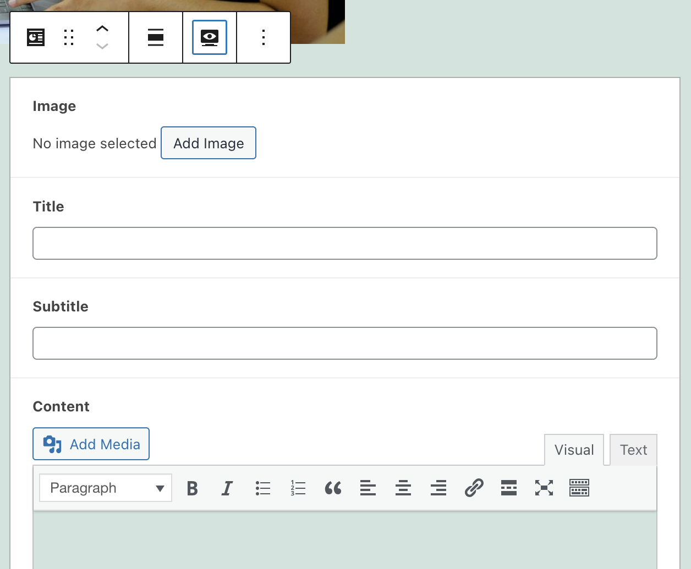

^ Demo it in the editor

---

# Block registration

[.code-highlight: 9]

```php
acf_register_block_type(array(
    'name'            => 'jhl-split-image-block',
    'title'           => __('Split Image'),
    'description'     => __('Block with an image on one side, content on the other'),
    'render_template' => 'template-parts/blocks/split-image/split-image.php',
    'enqueue_style'   => get_stylesheet_directory_uri() . '/template-parts/blocks/split-image/split-image.css',
    'category'        => 'layout',
    'icon'            => 'analytics',
    'mode'            => 'edit',
));
```

^ To get around this issue of having the block be empty when first loaded, I like to set the `mode` to be `edit`.

---

# Split image block final result in editor


---

# Split image block final result on site


---

# Latest posts block

This block will support the following fields

- Title
- Subtitle
- Image
- Content
- List of posts from the posts content type
  - Allow the user to specify how many posts
  - Allow the user to specify a category

^ This will be the same as the split image block, but with additional fields for setting the number of posts to show, and what category to filter on - if any.

---

# Block registration

```php
acf_register_block_type(array(
    'name'            => 'jhl-latest-posts-block',
    'title'           => __('Latest Posts'),
    'description'     => __('Block with an title, content, and latest posts'),
    'render_template' => 'template-parts/blocks/latest-posts/latest-posts.php',
    'enqueue_style'   => get_stylesheet_directory_uri() . '/template-parts/blocks/latest-posts/latest-posts.css',
    'category'        => 'layout',
    'icon'            => 'analytics',
    'mode'            => 'edit',
));
```

^ Basically the same as the split image block code. We changed the folder name and created new PHP and CSS files.

---

# Creating the block in ACF

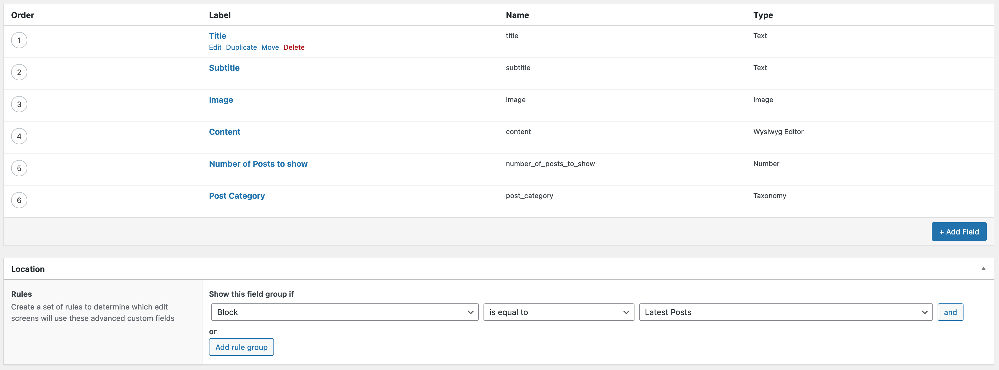

^ Here you can see we added the two additional fields, "Number of posts to show" and "post category". Then we set the location to be "block" equal to "latest posts".

---

# Block template coding

```php
$latest_posts_args = [
    'post_type' => 'post',
];
if ( $acf_fields['number_of_posts_to_show'] ) {
    $latest_posts_args['posts_per_page'] = $acf_fields['number_of_posts_to_show'];
}
if ( $acf_fields['post_category'] ) {
    $latest_posts_args['category__in'] = $acf_fields['post_category'];
}
$latest_posts = new WP_Query( $latest_posts_args );
```

^ While the basic template is the same as the split image example, additional code is needed to pull in the posts, which is what is shown here.

---

# Block template coding

```html
<?php if ( $latest_posts->have_posts() ) { ?>
    <div class="latest-posts-list <?php echo $align_class; ?>">
        <?php while ( $latest_posts->have_posts() ) {
            $latest_posts->the_post();
            ?>
            <div class="latest-post">
                <div class="latest-post-title">
                    <a href="<?php the_permalink(); ?>"><?php the_title(); ?></a>
                </div>
                <div class="latest-post-content"><?php the_excerpt(); ?></div>
            </div>
        <?php } ?>
    </div>
<?php } ?>
```

^ And we have the code at the bottom of the template to display the posts that were queried.

---

# Latest posts block in the editor

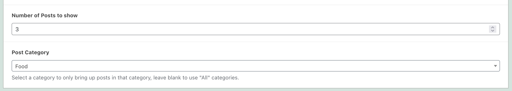

^ Again, the bulk of the form is the same as the Split Image block, but we have these two additional fields to ask the user how many posts to show and what category to use.

---

# Latest posts block on site


---

# Slider block

Display a gallery of images in a slider component.

While the block fields are simple - a gallery field and a checkbox to open the images in a lightbox, the block code is more complex because it loads scripts and styles to facilitate the slider.

--- 

# Block registration

```php
acf_register_block_type(array(
    'name'            => 'slider',
    'title'           => __('Slider'),
    'description'     => __('ACF Slider w/large image support.'),
    'render_template' => 'template-parts/blocks/slider/slider.php',
    'category'        => 'embed',
    'icon'            => 'format-gallery',
    'keywords'        => array( 'slider', 'gallery', 'carousel' ),
    'align_content'   => 'center',
    'mode'            => 'edit',
    'enqueue_assets'  => function(){
        // wp_enqueue_style( 'slider-slick',                get_template_directory_uri() . '/template-parts/blocks/slider/slick.min.css' );
        wp_enqueue_style( 'slider-slick',                get_template_directory_uri() . '/template-parts/blocks/slider/slick.css' );
        wp_enqueue_style( 'slider-slick-theme',          get_template_directory_uri() . '/template-parts/blocks/slider/slick-theme.min.css' );
        wp_enqueue_script( 'slider-slick',               get_template_directory_uri() . '/template-parts/blocks/slider/slick.min.js', array('jquery'), '', true );
        wp_enqueue_style( 'slider-slick-lightbox-theme', get_template_directory_uri() . '/template-parts/blocks/slider/slick-lightbox.min.css' );
        wp_enqueue_script( 'slider-slick-lightbox',      get_template_directory_uri() . '/template-parts/blocks/slider/slick-lightbox.min.js', array('jquery','slider-slick'), '', true );
    },
));
```

--- 

[.code-highlight: 8]

# Block registration

```php
acf_register_block_type(array(
    'name'            => 'slider',
    'title'           => __('Slider'),
    'description'     => __('ACF Slider w/large image support.'),
    'render_template' => 'template-parts/blocks/slider/slider.php',
    'category'        => 'embed',
    'icon'            => 'format-gallery',
    'keywords'        => array( 'slider', 'gallery', 'carousel' ),
    'align_content'   => 'center',
    'mode'            => 'edit',
    'enqueue_assets'  => function(){
        // wp_enqueue_style( 'slider-slick',                get_template_directory_uri() . '/template-parts/blocks/slider/slick.min.css' );
        wp_enqueue_style( 'slider-slick',                get_template_directory_uri() . '/template-parts/blocks/slider/slick.css' );
        wp_enqueue_style( 'slider-slick-theme',          get_template_directory_uri() . '/template-parts/blocks/slider/slick-theme.min.css' );
        wp_enqueue_script( 'slider-slick',               get_template_directory_uri() . '/template-parts/blocks/slider/slick.min.js', array('jquery'), '', true );
        wp_enqueue_style( 'slider-slick-lightbox-theme', get_template_directory_uri() . '/template-parts/blocks/slider/slick-lightbox.min.css' );
        wp_enqueue_script( 'slider-slick-lightbox',      get_template_directory_uri() . '/template-parts/blocks/slider/slick-lightbox.min.js', array('jquery','slider-slick'), '', true );
    },
));
```

^ You can add keywords to help with searching for blocks

--- 

[.code-highlight: 11-17]

# Block registration

```php
acf_register_block_type(array(
    'name'            => 'slider',
    'title'           => __('Slider'),
    'description'     => __('ACF Slider w/large image support.'),
    'render_template' => 'template-parts/blocks/slider/slider.php',
    'category'        => 'embed',
    'icon'            => 'format-gallery',
    'keywords'        => array( 'slider', 'gallery', 'carousel' ),
    'align_content'   => 'center',
    'mode'            => 'edit',
    'enqueue_assets'  => function(){
        wp_enqueue_style( 'slider-slick',                get_template_directory_uri() . '/template-parts/blocks/slider/slick.css' );
        wp_enqueue_style( 'slider-slick-theme',          get_template_directory_uri() . '/template-parts/blocks/slider/slick-theme.min.css' );
        wp_enqueue_script( 'slider-slick',               get_template_directory_uri() . '/template-parts/blocks/slider/slick.min.js', array('jquery'), '', true );
        wp_enqueue_style( 'slider-slick-lightbox-theme', get_template_directory_uri() . '/template-parts/blocks/slider/slick-lightbox.min.css' );
        wp_enqueue_script( 'slider-slick-lightbox',      get_template_directory_uri() . '/template-parts/blocks/slider/slick-lightbox.min.js', array('jquery','slider-slick'), '', true );
    },
));
```

^ Use the `enqueue_assets` parameter when you need to add multiple styles or scripts for your block.

---

# Creating the block in ACF

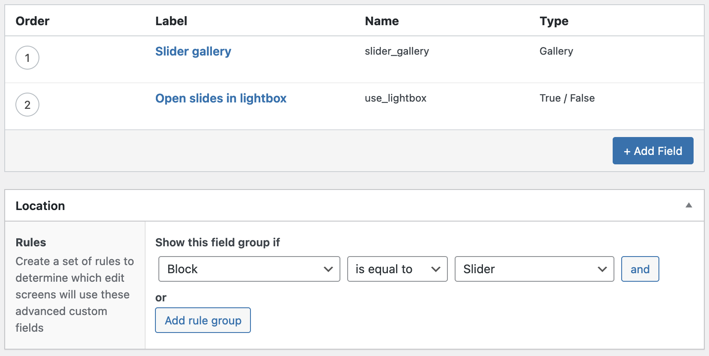

^ By now this should be straight-forward enough, we have the two fields that we want in the block, a gallery, and a checkbox as to whether to open the images in a lightbox.

^ Then we set the location to be the block named slider that we just registered.

---

# Slider in the block editor

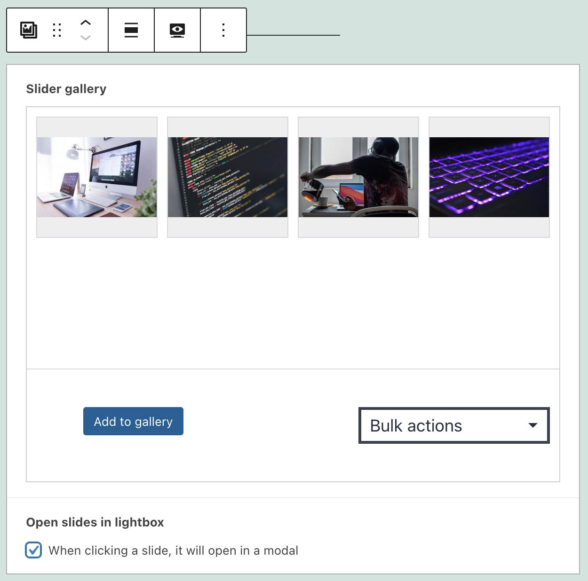

---

# Slider in on the front end


---

# References

- [https://www.advancedcustomfields.com/resources/blocks/]()
- [https://torquemag.io/2020/01/create-gutenberg-block-with-acf/]()
- [https://whiteleydesigns.com/acf-gutenberg-block-examples/]()

---

# Repositories

Presentation - [https://github.com/phoopee3/creating-blocks-using-acf]()

Code - [https://github.com/phoopee3/creating-blocks-using-acf-code]()

---

# Thank you

---

# Q&A
